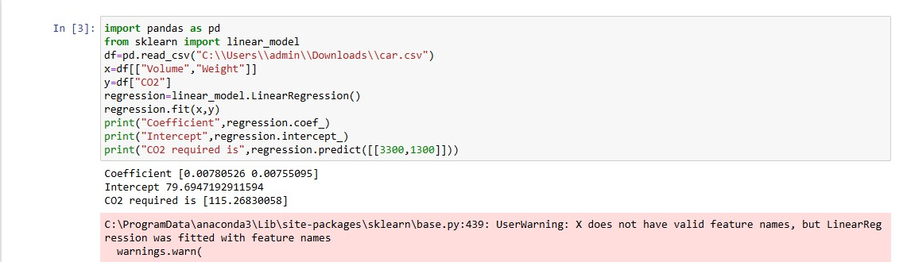

# Implementation of Multivariate Linear Regression
## Aim
To write a python program to implement multivariate linear regression and predict the output.
## Equipment’s required:
1.	Hardware – PCs
2.	Anaconda – Python 3.7 Installation / Moodle-Code Runner
## Algorithm:
### Step1
Import pandas as pd and sklearn into that import linear_model, by importing pandas and sklearn from python library.
### Step2
Use pandas inbuilt function to get and input csv file from user using pd.read_csv(path of csv file) command.
### Step3
From dataset select a two one independent variable is (Volume) and another is independent variable(Weight) and one dependent variable (CO2) to and to find the relationship of one or more two variables.
### Step4
Use linearmodel into that use linear regression function to compute the variables.
### Step5
Use regression.fit function of inputted variables of x and y and print corresponding results to get output.
### step6
Print Coefficient with use inbuilt function of regression(regression.coef_).
### step7
Print intercept with use of inbuilt function of regression(regression.intercept_).
### step8
Print CO2 required using inbuilt function of regression(regression.predict([100,929])).
## Program:
```
Developer by: RASINDHAN R
Register Number: 24005508

import pandas as pd
from sklearn import linear_model
df=pd.read_csv('C:\\Users\\admin\\Downloads\\car.csv')
x=df[["volume","Weight"]]
y=df["CO2"]
regression=linear_model.LinearRegression()
regression.fit(x,y)
print("Coefficient",regression.coef_)
print("Intercept",regression.intercept_)
print("CO2 required is",regression.predict([[3300,1300]]))    


```
## Output:



## Result
Thus the multivariate linear regression is implemented and predicted the output using python program.